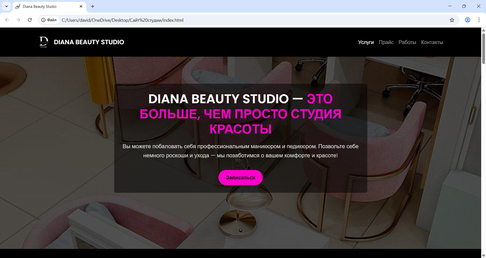

# Beauty Studio Landing Page

A modern and responsive landing page created for a **beauty studio**.  
The website was designed to present services, prices, and booking options in a clean, elegant, and user-friendly way.

---

## Features

- **Responsive design** — works perfectly on desktop, tablet, and mobile  
-  **Modern and elegant UI** — clean layout with soft color palette  
-  Built using **HTML5**, **CSS3**, and **Bootstrap 5**  
-  Custom **Google Fonts** and CSS animations  
-  Contact section with call-to-action buttons  
-  Ready for portfolio or small business showcase

---

##  Technologies Used

| Technology | Description |
|-------------|-------------|
| **HTML5** | Structure and layout |
| **CSS3** | Styling and responsiveness |
| **Bootstrap 5** | Grid system and UI components |
| **Google Fonts** | Typography |
| **JavaScript** | Interactive elements |

---

##  Preview

---

##  Live Demo
👉 **[View Website on GitHub Pages](https://davidelvira042-star.github.io/-/)** 
---

## About the Author

**Elvira David**  
Aspiring Web Designer & Front-End Developer  
[davidelvira042@gmail.com](mailto:davidelvira042@gmail.com)  

---

## Project Details

This project was created as part of my web development learning journey.  
It helped me practice:
- Building responsive layouts with **Bootstrap**
- Creating clean UI/UX designs
- Combining creativity and code  

I’m passionate about continuous learning, design, and front-end development — and this project reflects my progress as a beginner web designer.

---
 *If you like this project, feel free to star the repository and share feedback!*
